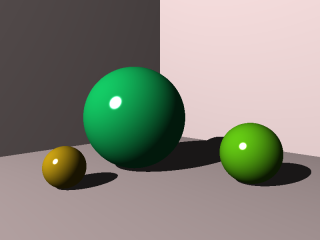

# RayTracingChallenge
 

## Introduction

Implementation of ray tracer based on [The Ray Tracer Challenge](https://pragprog.com/book/jbtracer/the-ray-tracer-challenge) book by Jamis Buck. 

## References

 * [Foundations of Game Engine Development, Eric Lengyel](https://foundationsofgameenginedev.com/)
 * [Mathematics for 3D Game Programming and Computer Graphics, Third Edition](https://www.mathfor3dgameprogramming.com/)
 * [Project page](https://www.protsyk.com/cms/?page_id=3018)
